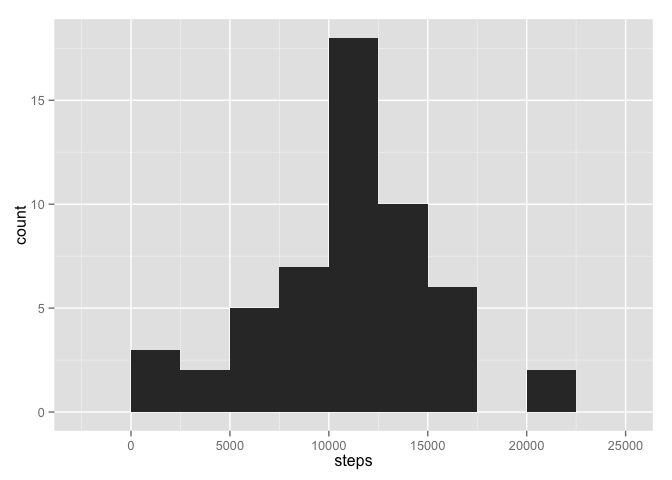
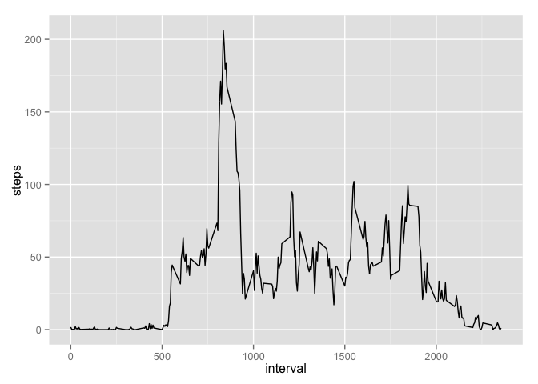
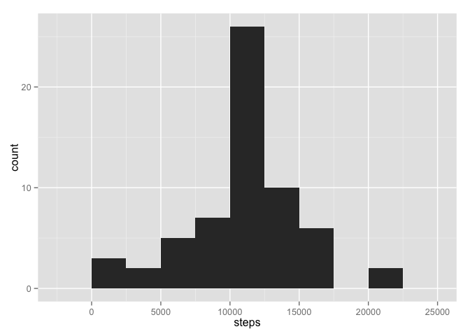
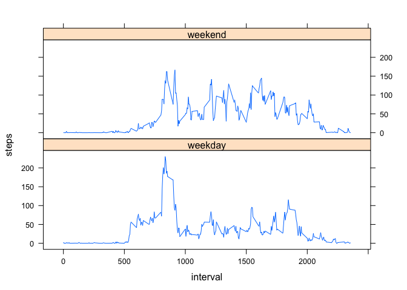

# Reproducible Research: Peer Assessment 1
citywright  
15 November 2015  

This report is my submission for Peer Assessment #1 for "Reproducable Research",
Course #5 of 9 in the Johns Hopkins Univeristy Data Science track on Coursera.

The first step in the analysis is to load and pre-process the data.  The code below
assumes that the data has been downloaded and is it the current working directory.

This code chunk also loads the libraries for ggplot2 and lattice, which are used 
to create charts and plots later in the report.


```r
library(ggplot2)
library(lattice)

act <- read.csv("activity.csv", stringsAsFactors=FALSE)
act$date <- as.Date(act$date)

pAve <- aggregate(steps ~ interval, data=act, mean)
pSum <- aggregate(steps ~ interval, data=act, sum)
pMed <- aggregate(steps ~ interval, data=act, median)

dAve <- aggregate(steps ~ date, data=act, mean)
dSum <- aggregate(steps ~ date, data=act, sum)
dMed <- aggregate(steps ~ date, data=act, median)
```

The code above creates a number of summary tables containing the mean, sum, and 
median values for the number of steps.  These summary statistics are aggregated 
over each 5-minute time interval and each day.

## Question 1: What is mean total number of steps taken per day?


```r
dailyHist <- qplot(steps, data=dSum, type="histogram", binwidth=2500)
dailyMean <- mean(dSum$steps)
dailyMed  <- median(dSum$steps)
print(dailyHist)
```

 

The average (mean) number of steps per day in the original dataset is 1.0766189\times 10^{4}.

The median number of steps per day in the original dataset is 10765.

## Question 2: What is the average daily activity pattern?


```r
timeSeries <- ggplot(pAve, aes(interval, steps)) + geom_line()
maxInterval <- pAve$interval[which.max(pAve$steps)]
print(timeSeries)
```

 

The 5-minute interval that contains the maximum number of steps, 
on average across all the days, is 835.

## Question 3: Imputing missing values


```r
missing <- sum(is.na(act$steps))

imputed <- act
for (i in 1:nrow(imputed)) {
        if(is.na(imputed[i,"steps"])) {
                period <- act[i,"interval"]
                impute <- pAve[pAve$interval==period,"steps"]
                imputed[i,"steps"] <- impute
        }
        
}

ipAve <- aggregate(steps ~ interval, data=imputed, mean)
ipSum <- aggregate(steps ~ interval, data=imputed, sum)
ipMed <- aggregate(steps ~ interval, data=imputed, median)

idAve <- aggregate(steps ~ date, data=imputed, mean)
idSum <- aggregate(steps ~ date, data=imputed, sum)
idMed <- aggregate(steps ~ date, data=imputed, median)

imputedHist <- qplot(steps, data=idSum, type="histogram", binwidth=2500)
imputedMean <- mean(idSum$steps)
imputedMed  <- median(idSum$steps)
```

There are 2304 missing values in the dataset.

A complete dataset was calculated by imputing values wherever there were missing
step number values in the original dataset.  The value used in place of missing 
values was the average number of steps for the 5-minute interval where the missing
value took place.

The following is a historgram of that new dataset:


```r
print(imputedHist)
```

 

The average (mean) number of steps per day in the imputed dataset is 1.0766189\times 10^{4}.

The median number of steps per day in the imputed dataset is 1.0766189\times 10^{4}.

## Question 4: Are there differences in activity patterns between weekdays and weekends?

This part of the analysis requires creating a new factor variable that labels data 
for each date as either 'weekday' or 'weekend'.  To do this, I first created a logical
variable using the `weekdays()` function that gave TRUE if a date was a weekend and
FALSE if it was a weekday.  I then created an empty character vector, inserted text 
for either 'weekend' or 'weekday' depending on the state of the logical vector, and
then converted it to a factor variable inserted into the imputed dataset.


```r
weekendLogical <- weekdays(imputed$date) %in% c("Saturday", "Sunday")
weekendChar    <- vector(mode="character", length=length(weekendLogical))
weekendChar[weekendLogical==TRUE]  <- "weekend"
weekendChar[weekendLogical==FALSE] <- "weekday"
imputed$daytype <- as.factor(weekendChar)
```

The following panel plot compares the average number of steps per interval for days 
categorized as weekends against the average number of steps per interval for days
categorized as weekdays.  It is created using the `lattice` package.


```r
daytest <- aggregate(steps ~ interval + daytype, data=imputed, mean)
dayPlot <- xyplot(steps ~ interval | daytype, data=daytest, type="l", layout=c(1,2))
print(dayPlot)
```

 

So there you have it!  There is indeed quite a difference in the step patterns 
between weekends and weekdays.  Key differences include:

- A later start on weekends (around 800) than weekdays (around 515)

- A more pronounced peak of activity on weekday mornings around 900, perhaps a 
morning commute?

- More consistent activity across the day during weekend days, perhaps less sitting 
around at on office desk job.

However, the activity tends to fade to zero around 2000 (10 PM) on both weekdays
and weekends, with almost no activity between 0 (midnight) and 500 (5 AM) on any day.
